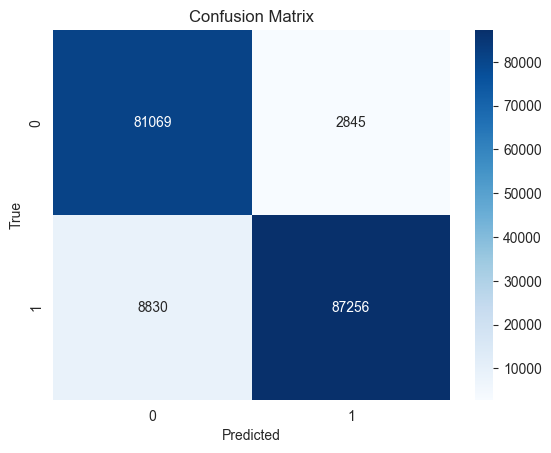
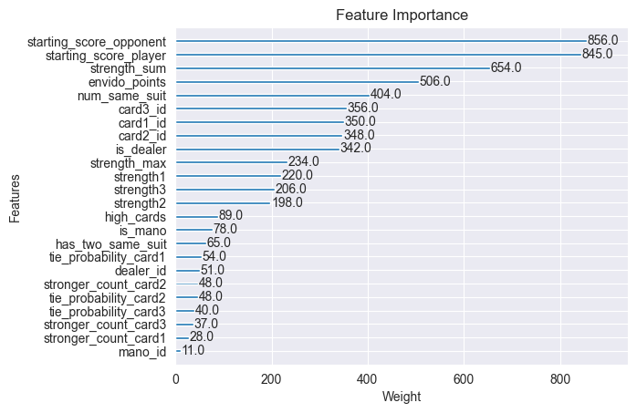

# truco-game-ai

This repository contains the full code developed for my undergraduate thesis:  
**"Strategic Decision Making by AI in Imperfect Information Games: A Case Study on Truco"**

## Project Overview

This thesis explores AI-driven gameplay using the classic 1-vs-1 card game **Truco** (Argentinian variant). The work focused on three core objectives:

1. Building the full Truco environment from scratch  
2. Developing a hand evaluation model using supervised learning  
3. Simulating strategic behavior through tree search techniques

Due to the complexity and time constraints of the project, reinforcement learning was not included. Instead, the focus remained on interpretable and modular techniques that allow for fine control and analysis.

## Core Components

### 1. Custom Truco Environment
- Full implementation of the 1vs1 version of classic Truco with all rules
- Built entirely from scratch in Python
- Supports bidding mechanics, card logic, and turn structure

### 2. Non-learning Baseline Agents
- Random Agent: Chooses actions at random
- Rule-based Agent: Uses heuristics for basic play and bidding
- Intermediate Agent: Introduces bluffing logic and probabilistic behavior

### 3. Supervised Learning for Hand Evaluation
- Created a dataset of approximately 900,000 samples simulating player hands and outcomes
- Trained an XGBoost model to predict the probability of winning based on hand

**Model Performance:**



Accuracy: 0.9351

| Class         | Precision | Recall | F1-score | Support  |
|---------------|-----------|--------|----------|----------|
| 0             | 0.90      | 0.97   | 0.93     | 83,914   |
| 1             | 0.97      | 0.91   | 0.94     | 96,086   |
| Macro Avg     | 0.94      | 0.94   | 0.94     | 180,000  |
| Weighted Avg  | 0.94      | 0.94   | 0.94     | 180,000  |




### 4. Game Simulations Using Tree Search

- Implemented Monte Carlo Tree Search (MCTS) for decision making
- Currently working on Information Set MCTS (ISMCTS) to incorporate hidden information more effectively
- Evaluation of simulation results is in progress

## Directory Structure

```
_thesis_/
├── game_sim/
│   ├── mcts.py
│   └── truco_sim.ipynb
├── hand_eval/
│   ├── dataset_creation.py
│   ├── hand_evaluation.ipynb
│   └── truco_training_data.csv
├── assets/
│   ├── confusion_matrix.png
│   └── feat_importance.png
├── truco_setup/
│   ├── basic_agents.py
│   ├── cards.py
│   ├── truco_environment.py
│   ├── rules.py
│   └── utils.py
├── LICENSE
└── README.md
```
## Academic Context

This project was developed as part of my undergraduate thesis in Artificial Intelligence at Johannes Kepler University Linz (JKU). It investigates how game mechanics, bluffing, and probabilistic reasoning can be modeled using supervised learning and search-based planning in imperfect information games.


Thesis Supervisor: Prof. Dr. Johannes Fürnkranz - Head of Computational Data Analytics Group at JKU

## Author

Agostina Vidal Villanueva

Visit my website: [agostinavidalvillanueva.com](https://agostinavidalvillanueva.com)
